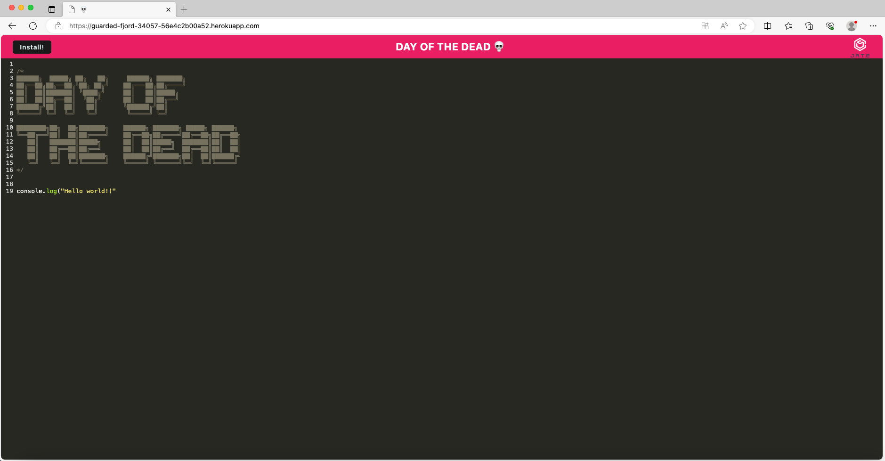
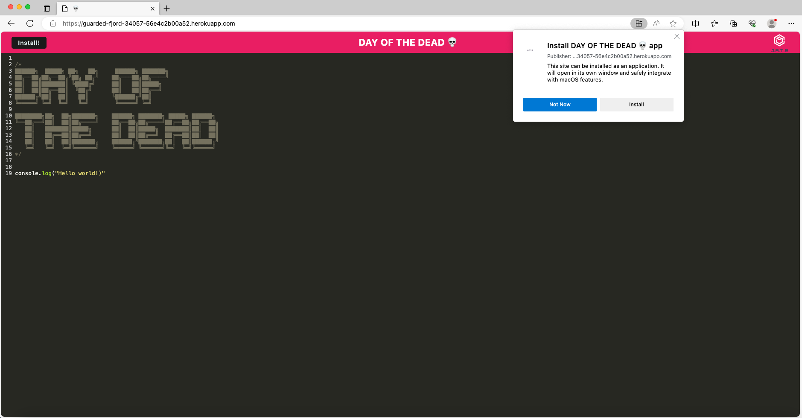
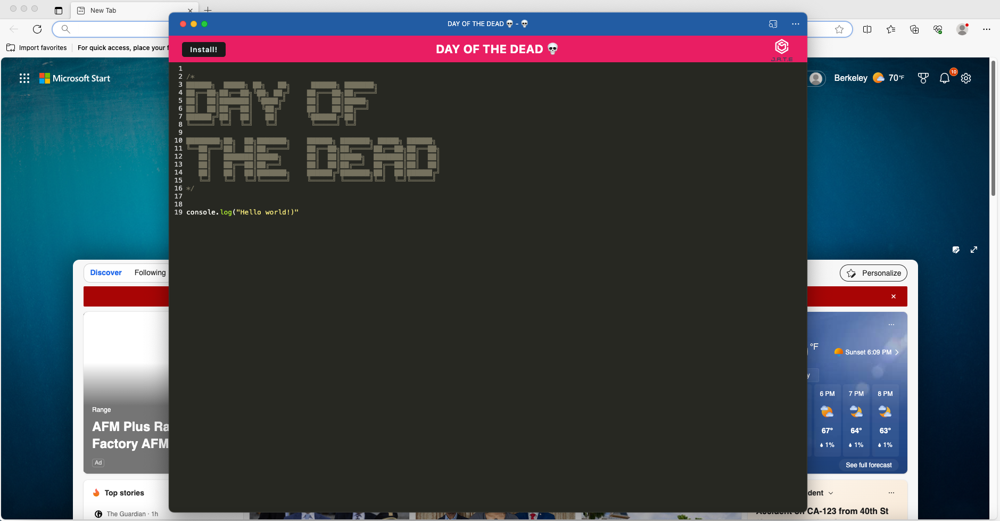
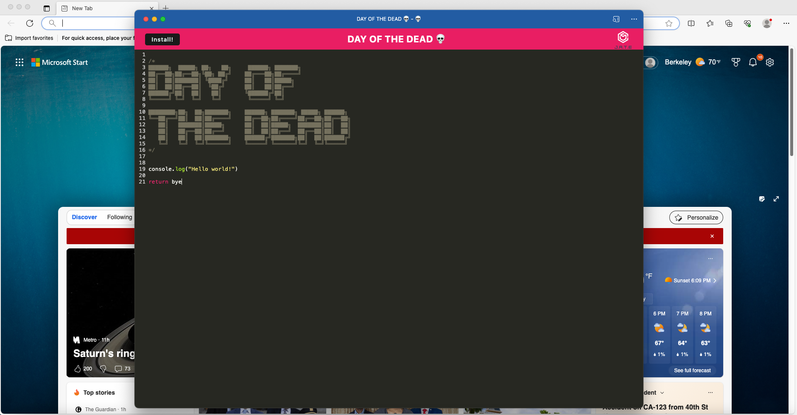
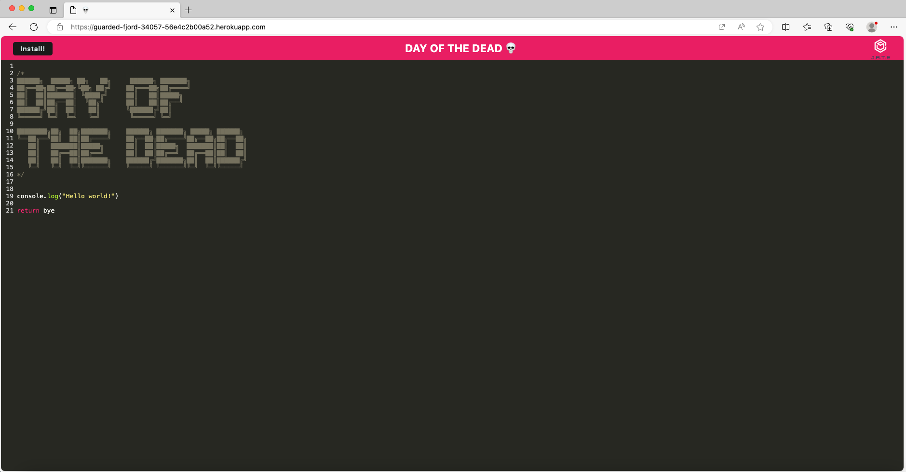
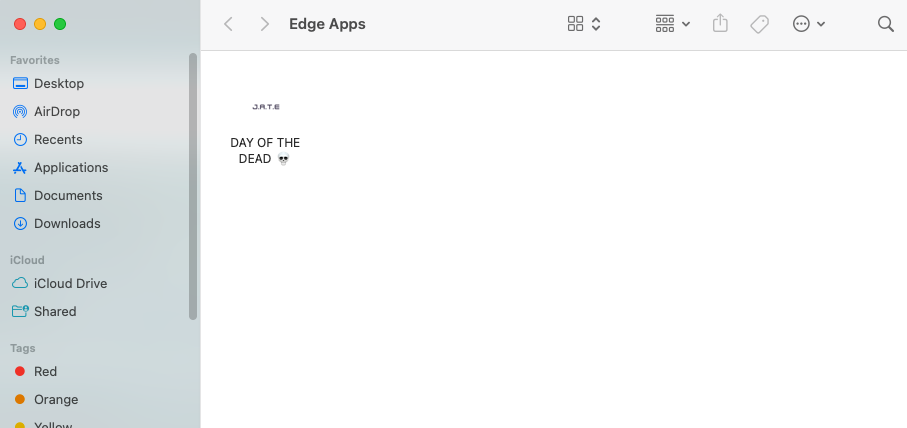

# DAY OF THE DEAD

[](https://opensource.org/licenses/MIT)

### ~ Progressive Web Applications (PWA) Challenge: Text Editor 📝

## Description

Motivation:

- We learned how to implement a pwa application!

Why this project was created:

- This challenge was created to understand better how to create a pwa and the use of it.

- Details


USER STORY

```
AS A developer
I WANT to create notes or code snippets with or without an internet connection
SO THAT I can reliably retrieve them for later use
```

ACCEPTANCE CRITERIA

```
GIVEN a text editor web application
WHEN I open my application in my editor
THEN I should see a client server folder structure
WHEN I run `npm run start` from the root directory
THEN I find that my application should start up the backend and serve the client
WHEN I run the text editor application from my terminal
THEN I find that my JavaScript files have been bundled using webpack
WHEN I run my webpack plugins
THEN I find that I have a generated HTML file, service worker, and a manifest file
WHEN I use next-gen JavaScript in my application
THEN I find that the text editor still functions in the browser without errors
WHEN I open the text editor
THEN I find that IndexedDB has immediately created a database storage
WHEN I enter content and subsequently click off of the DOM window
THEN I find that the content in the text editor has been saved with IndexedDB
WHEN I reopen the text editor after closing it
THEN I find that the content in the text editor has been retrieved from our IndexedDB
WHEN I click on the Install button
THEN I download my web application as an icon on my desktop
WHEN I load my web application
THEN I should have a registered service worker using workbox
WHEN I register a service worker
THEN I should have my static assets pre cached upon loading along with subsequent pages and static assets
WHEN I deploy to Heroku
THEN I should have proper build scripts for a webpack application
```

What we learned / used:

DATABASE

- `idb`


## Table of Contents

- [Installation](#installation)
- [Usage](#usage)
- [Testing](#testing)
- [Contributions](#contributing)
- [Credits](#credits)
- [License](#license)
- [Questions](#questions)

## Installation

To run the project in your local machine:

1. Open visual studio in your computer or laptop
2. Clone the git project: https://github.com/lilianpatinoortiz/Day-Of-The-Dead
3. Pull the latest from the 'main' branch
4. Open a new terminal and type `npm install` to install the dependencies
5. Run 'npm start'

## Usage

Please open localhost:3000 if you are running your application locally :)
Use this application to save notes, code or anything specific you need handy...  install the application and be ready to use it offline!

If you want to use the deployed application you can find it here: https://guarded-fjord-34057-56e4c2b00a52.herokuapp.com/

## Testing

This challenge does not contain specific test files, but below you can find the screenshots with the flow of the challenge functioning correctly:








## Contributing

If you want to contribute on this project please contact me directly via email lilly.0608@gmail.com. Happy coding!

## Credits

The main resources used:

- Module 19 information provided in canva
- Heroku for deploying the application

## License

Please refer to the license badge, on top of this file.

## Questions

Any question, please feel free to contact me directly via email lilly.0608@gmail.com or via https://github.com/lilianpatinoortiz
